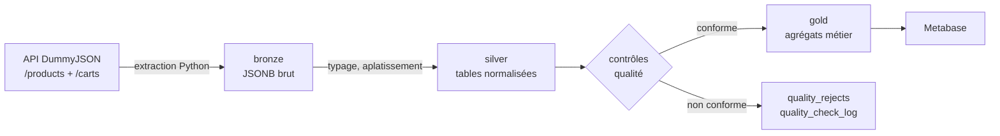
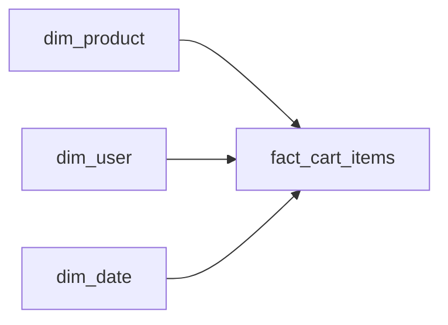

# Pipeline d'intégration de données — DummyJSON vers entrepôt PostgreSQL

Pipeline d'intégration orchestré qui récupère des produits et des paniers depuis une API REST,
les charge dans PostgreSQL en couches (bronze / silver / gold), contrôle leur qualité à chaque
étape et publie des tables métier agrégées.

Projet réalisé en une journée, conçu comme une démonstration des patterns d'intégration de
données : flux, orchestration, donnée pivot, idempotence et qualité.

> **À compléter avant publication** : remplacer les `TODO` par vos captures d'écran et le lien du dépôt.

---

## Objectif

Reproduire, de bout en bout, un flux d'intégration tel qu'on en rencontre en DSI : deux sources
distinctes, un référentiel et des transactions, reliées par une **donnée pivot**, avec des
contrôles qualité bloquants et une orchestration rejouable.

Le choix des outils (Airflow, PostgreSQL) relève de la maîtrise personnelle ; les **patterns**
mis en œuvre sont transposables à un environnement Oracle / SSIS. La section
[Transposition](#transposition-vers-un-environnement-oracle--ssis) détaille cette correspondance.

---

## Architecture



**Bronze** conserve la réponse de l'API telle quelle, en JSONB. Aucune transformation, aucune
perte : la couche est rejouable indéfiniment et sert de source de vérité locale.

**Silver** type, aplatit et déduplique. C'est ici que le tableau de lignes imbriqué des paniers
est éclaté, et que la donnée pivot (`product_id`) relie les paniers au référentiel produits.

**Gold** expose des agrégats métier en rechargement complet.

---

## Stack

| Composant | Rôle |
| --- | --- |
| Apache Airflow 3 | Orchestration (DAGs, dépendances, reprises, planification) |
| PostgreSQL | Entrepôt cible, stockage JSONB en bronze |
| Python | Extraction API, tâches de contrôle qualité |
| SQL | Transformations et règles de contrôle, versionnées en fichiers |
| Docker Compose | Environnement complet reproductible en une commande |
| Metabase | Restitution des tables gold |

Source de données : [DummyJSON](https://dummyjson.com/docs), API REST publique sans
authentification. Les endpoints `/products` (référentiel) et `/carts` (transactions) sont reliés
par l'identifiant produit, ce qui en fait un support idéal pour illustrer une donnée pivot.

---

## Transposition vers un environnement Oracle / SSIS

Ce projet utilise des outils ouverts, mais chaque brique a un équivalent direct en environnement
Microsoft / Oracle. Les patterns, eux, sont identiques.

| Ce projet | Équivalent Oracle / SSIS |
| --- | --- |
| PostgreSQL | Oracle / SQL Server |
| SQL de transformation (fichiers versionnés) | Procédures et packages PL/SQL |
| `INSERT ... ON CONFLICT` (upsert) | `MERGE` |
| DAG Airflow | Package SSIS (.dtsx) |
| Dépendances entre tasks | Control Flow |
| Task d'extraction / chargement | Data Flow Task |
| Airflow Connection (`conn_id`) | Connection Manager |
| Airflow Variable | Paramètre de projet SSIS |
| Scheduler Airflow | SQL Server Agent |
| Task de contrôle qualité générique | Composants de validation + table de rejets |
| Jointure sur `product_id` | Donnée pivot entre applications |
| Ce README | Cahier des charges |

Une différence de fond mérite d'être notée : SSIS transforme la donnée lui-même, en mémoire,
tandis qu'Airflow orchestre et délègue le calcul à SQL. Une migration SSIS vers Airflow n'est donc
pas une traduction ligne à ligne : elle s'accompagne généralement d'un basculement ETL vers ELT,
où la transformation redescend dans la base.

---

## Modèle de données

### Bronze

| Table | Grain | Contenu |
| --- | --- | --- |
| `bronze_products` | un produit | `product_id`, `content` (JSONB brut), `loaded_at` |
| `bronze_carts` | un panier | `cart_id`, `content` (JSONB brut), `loaded_at` |

Chargement en upsert sur la clé métier : rejouer un run ne crée pas de doublon.

### Silver

| Table | Grain | Clé |
| --- | --- | --- |
| `silver_products` | un produit | `product_id` |
| `silver_carts` | un panier (en-tête) | `cart_id` |
| `silver_cart_items` | un produit dans un panier | `(cart_id, product_id)` |

Les champs retenus sont ceux qui portent une valeur analytique ou de référentiel. Les tableaux
imbriqués non exploités (`reviews`, `tags`, `dimensions`, `images`) restent disponibles en bronze
et pourront être extraits sans nouvelle collecte.

`source_updated_at`, conservé depuis `meta.updatedAt`, est le champ sur lequel s'appuierait une
extraction incrémentale (CDC) sur une source réelle.

### Gold

| Table | Contenu |
| --- | --- |
| `gold_sales_by_category` | CA brut et net, quantités, panier moyen, remise moyenne par catégorie |
| `gold_top_products` | 20 meilleurs produits par chiffre d'affaires net |

Rechargement complet (`TRUNCATE` puis `INSERT`) : un agrégat est dérivé, donc recalculable, et
cette approche évite les lignes fantômes qu'un upsert laisserait subsister.

### Tables de supervision

| Table | Contenu |
| --- | --- |
| `quality_check_log` | Journal de tous les contrôles exécutés, par run et par règle |
| `quality_rejects` | Lignes mises en quarantaine, avec la règle violée |

---

## Qualité des données

Les contrôles sont déclarés en SQL, un fichier par table, dans `sql/quality/`. Chaque requête
respecte le même contrat : **zéro ligne signifie contrôle passé**, sinon une ligne par violation
avec les colonnes `rule_name`, `severity`, `entity_key`, `details`.

Une unique tâche Python générique exécute ces fichiers, regroupe par règle, applique les seuils,
alimente le journal et la table de rejets, puis décide de laisser passer ou d'interrompre le flux.
**Ajouter une règle ne demande aucune ligne de Python.**

### Deux portes de contrôle

**En amont (bronze)** — ce que l'on reçoit est-il exploitable : présence d'enregistrements, écart
volumétrique par rapport au run précédent. Ce contrôle attrape le cas où l'API répond `200` avec
une liste vide, situation qui viderait silencieusement l'aval.

**En aval (silver)** — la donnée est-elle juste. C'est là que se trouvent les deux contrôles
structurants :

- **Intégrité référentielle** sur la donnée pivot : tout `product_id` présent dans les lignes de
  panier doit exister au référentiel produits.
- **Réconciliation** : pour chaque panier, la somme des montants de lignes doit égaler le total
  porté par l'en-tête, à un centime près.

S'y ajoutent les règles de domaine (quantité strictement positive, prix positif, remise entre 0 et
100), de cohérence interne (`line_total` conforme à `unit_price × quantity`, remise n'augmentant
jamais un montant, statut de disponibilité cohérent avec le stock) et de complétude réelle
(une chaîne vide passe une contrainte `NOT NULL` tout en étant invalide).

### Trois postures face à une anomalie

| Sévérité | Traitement | Exemples |
| --- | --- | --- |
| `blocking` | Exception levée, DAG interrompu | Table vide, réconciliation en échec |
| `reject` | Mise en quarantaine, seuil global à 5 % | Violation de domaine, orphelin référentiel |
| `warning` | Journalisé, non bloquant | Dérive du taux de complétude d'un champ facultatif |

Le seuil traduit une règle simple : en dessous, une anomalie est un incident ponctuel ; au-dessus,
c'est un changement de contrat à la source, et le flux doit s'arrêter.

Les contrôles ne portent que sur ce que les contraintes de la base ne garantissent pas déjà.
Vérifier l'unicité d'une clé primaire serait du bruit ; vérifier l'unicité du `sku`, clé métier
non contrainte, ne l'est pas.

---

## Choix d'architecture et arbitrages

**Idempotence.** Chaque étape est rejouable sans effet de bord. Bronze et silver fonctionnent en
upsert sur la clé métier, gold en rechargement complet. Les fichiers d'extraction sont horodatés
par la date logique du run.

**Transport entre tâches.** La tâche d'extraction écrit la réponse dans un fichier et ne transmet
que le chemin via XCom. XCom s'appuie sur la base de métadonnées d'Airflow et n'est dimensionné
que pour de petites valeurs ; y faire transiter un payload complet est un anti-pattern.

**Grain des lignes de panier.** La source contient des paniers où un même produit figure sur
plusieurs lignes. Le grain retenu est le produit dans le panier, et les lignes répétées sont
**agrégées** (quantités et montants sommés) plutôt que dédupliquées : dédupliquer aurait fait
disparaître des quantités achetées. Si le détail ligne à ligne devenait un besoin, il suffirait
d'ajouter un numéro de ligne à la clé.

Conséquence assumée : le contrôle rapprochant `total_products` du nombre de lignes en silver n'est
volontairement pas implémenté, puisqu'il échouerait légitimement du fait de cette agrégation.

**Modèle dimensionnel.** Le périmètre s'arrête à des agrégats. Un modèle en étoile complet est
décrit plus bas, en conception : l'implémenter n'apportait rien de plus à la démonstration des
patterns d'intégration, qui sont le cœur du sujet.

**Gestion du schéma.** Le DDL est exécuté dans le flux pour que le projet soit auto-portant et
démarrable d'une seule commande. Ce n'est pas ce que je ferais en production : `IF NOT EXISTS` ne
gère pas l'évolution d'un schéma (il ne fait rien silencieusement si la définition change), et un
compte d'ingestion ne dispose généralement pas des droits DDL sur un entrepôt. La création de
schéma relève d'une étape de migration jouée séparément.

**Secrets et configuration.** Aucun identifiant dans le code : connexions et variables sont
déclarées côté Airflow, via variables d'environnement dans le `docker-compose`. Toutes les
requêtes sont paramétrées.

---

## Incidents rencontrés

Trois incidents réels, conservés ici parce qu'ils ont modifié la conception.

**Course sur la création de tables.** Deux DAGs exécutant simultanément le même
`CREATE TABLE IF NOT EXISTS` ont produit une violation du catalogue système PostgreSQL
(`pg_type_typname_nsp_index`). La clause `IF NOT EXISTS` n'est pas atomique : elle vérifie, puis
crée, et perd la course si un autre processus crée l'objet entre les deux. Corrigé par
`max_active_runs=1` et un propriétaire unique par table. C'est ce qui m'a convaincu que la gestion
de schéma relève d'une migration séparée.

**Doublons à l'upsert.** L'erreur *ON CONFLICT DO UPDATE command cannot affect row a second time*
signalait que la source produisait deux fois la même clé dans une seule commande. Le diagnostic a
révélé que le doublon n'était pas un artefact de rechargement mais un fait métier : un même
produit sur deux lignes d'un panier. La première question face à un doublon n'est jamais comment
le supprimer, mais s'il est technique ou métier — supprimer un doublon métier, c'est perdre de la
donnée en silence.

**Mélange de drivers.** Un appel à `psycopg2.extras.execute_values` sur une connexion fournie par
le hook Airflow a échoué (`'Connection' object has no attribute 'encoding'`) : le provider
retournait une connexion psycopg 3. Corrigé en repassant par l'API du hook
(`insert_rows(replace=True, replace_index=...)`), qui abstrait le driver sous-jacent. Descendre au
niveau du driver, c'est se lier à une version précise.

---

## Démarrage

```bash
git clone TODO_URL_DU_DEPOT
cd TODO_NOM_DU_DEPOT
docker compose up -d
```

| Service | URL | Identifiants |
| --- | --- | --- |
| Airflow | http://localhost:8080 | TODO |
| Metabase | http://localhost:3000 | TODO |
| PostgreSQL | localhost:5433 | TODO |

Déclencher ensuite les DAGs dans l'ordre : ingestion bronze (produits et paniers), puis
transformation silver, contrôles et gold.

---

## Structure du dépôt

```
dags/
  ingest_dummy_products.py      # bronze — produits
  ingest_dummy_carts.py         # bronze — paniers
  ingest_silver.py              # silver, contrôles qualité, gold
  utils/
    get_data.py                 # extraction API générique et paramétrée
  sql/
    create_silver_table.sql
    insert_silver_products.sql
    insert_silver_carts.sql
    insert_silver_cart_items.sql
    insert_gold_sales_by_category.sql
    insert_gold_top_products.sql
    quality/
      check_silver_products.sql
      check_silver_carts.sql
      check_silver_cart_items.sql
docker-compose.yml
README.md
```

---

## Captures

| | |
| --- | --- |
| Graphe du DAG dans Airflow | TODO |
| Tableau de bord Metabase | TODO |
| Extrait de `gold_sales_by_category` | TODO |

---

## Modèle cible (conception)

Au-delà du périmètre réalisé, la couche exposée évoluerait vers un schéma en étoile.



La table de faits référencerait des **clés de substitution** plutôt que les clés métier. Ce choix
isole l'entrepôt des changements de codification à la source et rend possible l'historisation en
SCD2 : au lieu d'écraser le prix d'un produit, on clôture la version courante et on en insère une
nouvelle, si bien que chaque ligne de panier reste rattachée au prix en vigueur au moment de
l'achat.

Le schéma retenu serait une étoile et non un flocon. Les dimensions sont ici de faible cardinalité
et peu profondes : normaliser `brand` et `category` dans des tables séparées coûterait des
jointures sans bénéfice de stockage réel. Le flocon se justifie lorsqu'une dimension devient
volumineuse, hiérarchique, ou partagée entre plusieurs tables de faits — le cas d'un référentiel
article à plusieurs niveaux de familles.

---

## Limites et suites

**Non implémenté, et pourquoi.**

L'extraction est complète à chaque run. Une extraction incrémentale supposerait un filtre à la
source sur `updated_at`, que DummyJSON ne propose pas ; le champ est néanmoins conservé en silver
pour rendre ce basculement immédiat.

Les paniers de la source ne portent aucune date de transaction. Toute dimension temporelle ne
pourrait donc refléter que la date de chargement, pas une date métier — raison pour laquelle elle
n'a pas été construite.

Les lignes mises en quarantaine restent présentes en silver et alimentent donc les agrégats tant
que le seuil de 5 % n'est pas franchi. Un traitement plus strict les exclurait du gold.

**Suites envisagées.** Tests unitaires sur les fonctions de transformation, intégration continue
exécutant le linter et ces tests, opérateur Airflow dédié encapsulant la logique de contrôle
qualité, alerting sur échec de flux, et historisation SCD2 du référentiel produits.